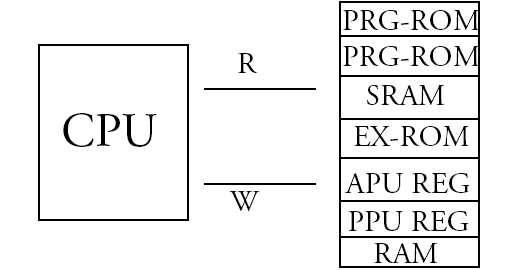
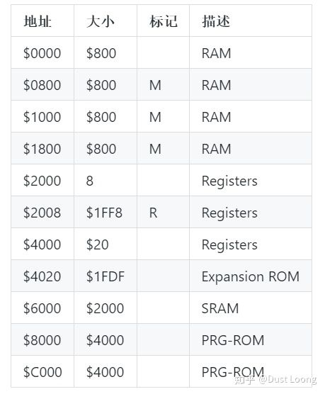

# 从零开始8位NES模拟器 unity csharp 版本
关于本文的目的：
* 学习一下前辈的做游戏的思路，也检验一下自己的计算机水平，看看几斤几两    
* 自己在游戏行业也驰骋多年，对现在的手机游戏行业确实看不懂，却一直喜欢童年的记忆，也是做这个的动机之一。  
本文借鉴了2位大大的文章
以下是他们的链接  
https://zhuanlan.zhihu.com/p/44035613  
https://github.com/Xyene/Emulator.NES


## 第一章 加载ROM
``` csharp
        /// <summary>
        /// 文件头:
        /// 0-3: string    "NES"<EOF>
        ///   4: byte 以16384(0x4000)字节作为单位的PRG-ROM大小数量
        ///   5: byte 以 8192(0x2000)字节作为单位的CHR-ROM大小数量
        ///   6: bitfield Flags 6
        ///   7: bitfield Flags 7
        ///8-15: byte 保留用, 应该为0. 其实有些在用了, 目前不管

        ///CHR-ROM - 角色只读存储器(用于图像显示, 暂且不谈)

        ///Flags 6:
        ///7       0
        ///---------
        ///NNNN FTBM

        ///N: Mapper编号低4位
        ///F: 4屏标志位. (如果该位被设置, 则忽略M标志)
        ///T: Trainer标志位.  1表示 $7000-$71FF加载 Trainer
        ///B: SRAM标志位 $6000-$7FFF拥有电池供电的SRAM.
        ///M: 镜像标志位.  0 = 水平, 1 = 垂直.

        ///Byte 7 (Flags 7):
        ///7       0
        ///---------
        ///NNNN xxPV

        ///N: Mapper编号高4位
        ///P: Playchoice 10标志位.被设置则表示为PC-10游戏
        ///V: Vs.Unisystem标志位.被设置则表示为Vs.游戏
        ///x: 未使用
        /// </summary>
        /// <param name="filename"></param>
        public Cartridge(string filename)
        {
            Raw = System.IO.File.ReadAllBytes(filename);

            int header = BitConverter.ToInt32(Raw, 0);
            if (header != 0x1A53454E) // "NES<EOF>"
                throw new FormatException("unexpected header value " + header.ToString("X"));

            PRGROMSize = Raw[4] * 0x4000; // 16kb units
            CHRROMSize = Raw[5] * 0x2000; // 8kb units
            PRGRAMSize = Raw[8] * 0x2000;

            bool hasTrainer = (Raw[6] & 0b100) > 0;
            PRGROMOffset = 16 + (hasTrainer ? 512 : 0);

            MirroringMode = (Raw[6] & 0x1) > 0 ? VRAMMirroringMode.Vertical : VRAMMirroringMode.Horizontal;
            if ((Raw[6] & 0x8) > 0) MirroringMode = VRAMMirroringMode.All;

            MapperNumber = (Raw[6] >> 4) | (Raw[7] & 0xF0);

            PRGROM = new byte[PRGROMSize];
            Array.Copy(Raw, PRGROMOffset, PRGROM, 0, PRGROMSize);

            if (CHRROMSize == 0)
                CHRROM = new byte[0x2000];
            else
            {
                CHRROM = new byte[CHRROMSize];
                Array.Copy(Raw, PRGROMOffset + PRGROMSize, CHRROM, 0, CHRROMSize);
            }
        }
```
根据注释加载ROM，ROM的解析都在代码里了，其实还是比较简单的，没有什么难度

## 第二章 CPU基础读写
本文参考  
https://zhuanlan.zhihu.com/p/44042256  
https://github.com/Xyene/Emulator.NES  
http://wiki.nesdev.com/w/index.php/NROM  

6502的内存布局  


``` csharp
    /// <summary>
    /// Mapper 基础实现 用于地址转换
    /// </summary>
    public abstract class BaseMapper
    {
        protected readonly Emulator _emulator;
        protected readonly byte[] _prgROM;
        protected readonly byte[] _prgRAM = new byte[0x2000];
        protected readonly byte[] _chrROM;
        protected readonly uint _lastBankOffset;

        protected BaseMapper(Emulator emulator)
        {
            _emulator = emulator;
            var cart = emulator.Cartridge;
            _prgROM = cart.PRGROM;
            _chrROM = cart.CHRROM;
            _lastBankOffset = (uint) _prgROM.Length - 0x4000;
        }

        public virtual void InitializeMemoryMap(CPU cpu)
        {

        }

        public virtual void InitializeMemoryMap(PPU ppu)
        {
            ppu.MapReadHandler(0x0000, 0x1FFF, addr => _chrROM[addr]);
            ppu.MapWriteHandler(0x0000, 0x1FFF, (addr, val) => _chrROM[addr] = val);
        }

        public virtual void ProcessCycle(int scanline, int cycle)
        {

        }

        public virtual void Save(Stream os)
        {
            os.Write(_prgRAM, 0, _prgRAM.Length);
        }

        public virtual void Load(Stream os)
        {
            using (BinaryReader binaryReader = new BinaryReader(os))
            {
                byte[] ram = binaryReader.ReadBytes((int)os.Length);
                Array.Copy(ram, _prgRAM, ram.Length);
            }
        }
    }

    
    /// <summary>
    /// Mapper000 - NROM
    /// </summary>
    [MapperDef(0)]
    class NROM : BaseMapper
    {
        private readonly byte[] _addressSpace = new byte[0x2000 + 0x8000]; // Space for $2000 VRAM + $8000 PRG
        public NROM(Emulator emulator) : base(emulator)
        {
            //从卡带中读取ROM地址
            for (int i = 0; i < 0x8000; i++)
            {
                int offset = _emulator.Cartridge.PRGROMSize == 0x4000 ? i & 0xBFFF : i;
                //如果PRG是16KB也就是读取 $0000 - $3FFF 从$4000开始到$7FFF也是读取 $0000 - $3FFF 注意&
                //否则就读取 $0000-$7FFF
                _addressSpace[0x2000 + i] = _prgROM[offset]; //前面8KB是显存地址 
            }
        }

        /// <summary>
        /// 我们要找到卡带中的内存区域
        /// </summary>
        /// <param name="cpu"></param>
        public override void InitializeMemoryMap(CPU cpu)
        {
            //6502
            //0: [$0000, $2000) 系统主内存
            //1: [$2000, $4000) PPU 寄存器
            //2: [$4000, $6000) pAPU寄存器以及扩展区域
            //3: [$6000, $8000) 存档用SRAM区
            //4: [$8000, $FFFF] 可读PGRROM区
            //解释SRAM: 存档(SAVE)用RAM, 有些卡带额外带了用电池供电的RAM PRG-ROM: 程序只读储存器: 存储程序代码的存储器.放入CPU地址空间.

            //cpu 的0x6000 - 0xFFFF 即SRAM + PGRROM  可读
            cpu.MapReadHandler(0x6000, 0xFFFF, addr => _addressSpace[addr - 0x6000]);  
            //cpu 的0x6000 - 0x7FFF 即SRAM 可以写入
            cpu.MapWriteHandler(0x6000, 0x7FFF, (addr, val) => _addressSpace[addr - 0x6000] = val);

        }
    }
```