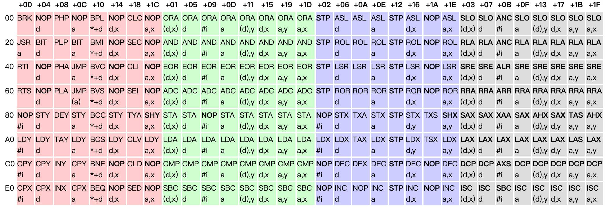

# 从零开始8位NES模拟器 unity csharp 版本
关于本文的目的：
* 学习一下前辈的做游戏的思路，也检验一下自己的计算机水平，看看几斤几两    
* 自己在游戏行业也驰骋多年，对现在的手机游戏行业确实看不懂，却一直喜欢童年的记忆，也是做这个的动机之一。  
本文借鉴了2位大大的文章
以下是他们的链接  
https://zhuanlan.zhihu.com/p/44035613  
https://github.com/Xyene/Emulator.NES


## 第一章 加载ROM
``` csharp
        /// <summary>
        /// 文件头:
        /// 0-3: string    "NES"<EOF>
        ///   4: byte 以16384(0x4000)字节作为单位的PRG-ROM大小数量
        ///   5: byte 以 8192(0x2000)字节作为单位的CHR-ROM大小数量
        ///   6: bitfield Flags 6
        ///   7: bitfield Flags 7
        ///8-15: byte 保留用, 应该为0. 其实有些在用了, 目前不管

        ///CHR-ROM - 角色只读存储器(用于图像显示, 暂且不谈)

        ///Flags 6:
        ///7       0
        ///---------
        ///NNNN FTBM

        ///N: Mapper编号低4位
        ///F: 4屏标志位. (如果该位被设置, 则忽略M标志)
        ///T: Trainer标志位.  1表示 $7000-$71FF加载 Trainer
        ///B: SRAM标志位 $6000-$7FFF拥有电池供电的SRAM.
        ///M: 镜像标志位.  0 = 水平, 1 = 垂直.

        ///Byte 7 (Flags 7):
        ///7       0
        ///---------
        ///NNNN xxPV

        ///N: Mapper编号高4位
        ///P: Playchoice 10标志位.被设置则表示为PC-10游戏
        ///V: Vs.Unisystem标志位.被设置则表示为Vs.游戏
        ///x: 未使用
        /// </summary>
        /// <param name="filename"></param>
        public Cartridge(string filename)
        {
            Raw = System.IO.File.ReadAllBytes(filename);

            int header = BitConverter.ToInt32(Raw, 0);
            if (header != 0x1A53454E) // "NES<EOF>"
                throw new FormatException("unexpected header value " + header.ToString("X"));

            PRGROMSize = Raw[4] * 0x4000; // 16kb units
            CHRROMSize = Raw[5] * 0x2000; // 8kb units
            PRGRAMSize = Raw[8] * 0x2000;

            bool hasTrainer = (Raw[6] & 0b100) > 0;
            PRGROMOffset = 16 + (hasTrainer ? 512 : 0);

            MirroringMode = (Raw[6] & 0x1) > 0 ? VRAMMirroringMode.Vertical : VRAMMirroringMode.Horizontal;
            if ((Raw[6] & 0x8) > 0) MirroringMode = VRAMMirroringMode.All;

            MapperNumber = (Raw[6] >> 4) | (Raw[7] & 0xF0);

            PRGROM = new byte[PRGROMSize];
            Array.Copy(Raw, PRGROMOffset, PRGROM, 0, PRGROMSize);

            if (CHRROMSize == 0)
                CHRROM = new byte[0x2000];
            else
            {
                CHRROM = new byte[CHRROMSize];
                Array.Copy(Raw, PRGROMOffset + PRGROMSize, CHRROM, 0, CHRROMSize);
            }
        }
```
## 总结  
根据注释加载ROM，ROM的解析都在代码里了，其实还是比较简单的，没有什么难度  

---
## 第二章 CPU基础读写
本文参考  
https://zhuanlan.zhihu.com/p/44042256  
https://github.com/Xyene/Emulator.NES  
http://wiki.nesdev.com/w/index.php/NROM  

6502的内存布局  


``` csharp
    /// <summary>
    /// Mapper 基础实现 用于地址转换
    /// </summary>
    public abstract class BaseMapper
    {
        protected readonly Emulator _emulator;
        protected readonly byte[] _prgROM;
        protected readonly byte[] _prgRAM = new byte[0x2000];
        protected readonly byte[] _chrROM;
        protected readonly uint _lastBankOffset;

        protected BaseMapper(Emulator emulator)
        {
            _emulator = emulator;
            var cart = emulator.Cartridge;
            _prgROM = cart.PRGROM;
            _chrROM = cart.CHRROM;
            _lastBankOffset = (uint) _prgROM.Length - 0x4000;
        }

        public virtual void InitializeMemoryMap(CPU cpu)
        {

        }

        public virtual void InitializeMemoryMap(PPU ppu)
        {
            ppu.MapReadHandler(0x0000, 0x1FFF, addr => _chrROM[addr]);
            ppu.MapWriteHandler(0x0000, 0x1FFF, (addr, val) => _chrROM[addr] = val);
        }

        public virtual void ProcessCycle(int scanline, int cycle)
        {

        }

        public virtual void Save(Stream os)
        {
            os.Write(_prgRAM, 0, _prgRAM.Length);
        }

        public virtual void Load(Stream os)
        {
            using (BinaryReader binaryReader = new BinaryReader(os))
            {
                byte[] ram = binaryReader.ReadBytes((int)os.Length);
                Array.Copy(ram, _prgRAM, ram.Length);
            }
        }
    }

    
    /// <summary>
    /// Mapper000 - NROM
    /// </summary>
    [MapperDef(0)]
    class NROM : BaseMapper
    {
        private readonly byte[] _addressSpace = new byte[0x2000 + 0x8000]; // Space for $2000 VRAM + $8000 PRG
        public NROM(Emulator emulator) : base(emulator)
        {
            //从卡带中读取ROM地址
            for (int i = 0; i < 0x8000; i++)
            {
                int offset = _emulator.Cartridge.PRGROMSize == 0x4000 ? i & 0xBFFF : i;
                //如果PRG是16KB也就是读取 $0000 - $3FFF 从$4000开始到$7FFF也是读取 $0000 - $3FFF 注意&
                //否则就读取 $0000-$7FFF
                _addressSpace[0x2000 + i] = _prgROM[offset]; //前面8KB是显存地址 
            }
        }

        /// <summary>
        /// 我们要找到卡带中的内存区域
        /// </summary>
        /// <param name="cpu"></param>
        public override void InitializeMemoryMap(CPU cpu)
        {
            //6502
            //0: [$0000, $2000) 系统主内存
            //1: [$2000, $4000) PPU 寄存器
            //2: [$4000, $6000) pAPU寄存器以及扩展区域
            //3: [$6000, $8000) 存档用SRAM区
            //4: [$8000, $FFFF] 可读PGRROM区
            //解释SRAM: 存档(SAVE)用RAM, 有些卡带额外带了用电池供电的RAM PRG-ROM: 程序只读储存器: 存储程序代码的存储器.放入CPU地址空间.

            //cpu 的0x6000 - 0xFFFF 即SRAM + PGRROM  可读
            cpu.MapReadHandler(0x6000, 0xFFFF, addr => _addressSpace[addr - 0x6000]);  
            //cpu 的0x6000 - 0x7FFF 即SRAM 可以写入
            cpu.MapWriteHandler(0x6000, 0x7FFF, (addr, val) => _addressSpace[addr - 0x6000] = val);

        }
    }
```
## 总结 
介绍了CPU的一些内存布局，如何从卡带加载ROM  

---
# 第三章 6502汇编
参考文章  
http://wiki.nesdev.com/w/index.php/CPU_unofficial_opcodes#Games_using_unofficial_opcodes  
https://zhuanlan.zhihu.com/p/44051504  
操作码
```
6502汇编用\$表示十六进制, 那先讲讲6502机器码, 由一个操作码和0~2个地址码构成, 都是8位的:
```

  
所有操作码对应的实现 8bit 256种
``` csharp
[AttributeUsage(AttributeTargets.Method, Inherited = false, AllowMultiple = true)]
        public class OpcodeDef : Attribute
        {
            public int Opcode;
            public int Cycles = 1;
            public bool PageBoundary;
            public bool RMW;
            public AddressingMode Mode = None;
        }

        [OpcodeDef(Opcode = 0x20, Cycles = 6)]
        private void JSR()
        {
            PushWord(PC + 1);
            PC = NextWord();
        }

        [OpcodeDef(Opcode = 0x40, Cycles = 6)]
        private void RTI()
        {
            // TODO: this dummy fetch should happen for all single-byte instructions
            NextByte();
            P = Pop();
            PC = PopWord();
        }

        [OpcodeDef(Opcode = 0x60, Cycles = 6)]
        private void RTS()
        {
            NextByte();
            PC = PopWord() + 1;
        }

        [OpcodeDef(Opcode = 0xC8, Cycles = 2)]
        private void INY() => Y++;

        [OpcodeDef(Opcode = 0x88, Cycles = 2)]
        private void DEY() => Y--;

        [OpcodeDef(Opcode = 0xE8, Cycles = 2)]
        private void INX() => X++;

        [OpcodeDef(Opcode = 0xCA, Cycles = 2, RMW = true)]
        private void DEX() => X--;

        [OpcodeDef(Opcode = 0xA8, Cycles = 2)]
        private void TAY() => Y = A;

        [OpcodeDef(Opcode = 0x98, Cycles = 2)]
        private void TYA() => A = Y;

        [OpcodeDef(Opcode = 0xAA, Cycles = 2, RMW = true)]
        private void TAX() => X = A;

        [OpcodeDef(Opcode = 0x8A, Cycles = 2, RMW = true)]
        private void TXA() => A = X;

        [OpcodeDef(Opcode = 0xBA, Cycles = 2)]
        private void TSX() => X = SP;

        [OpcodeDef(Opcode = 0x9A, Cycles = 2, RMW = true)]
        private void TXS() => SP = X;

        [OpcodeDef(Opcode = 0x08, Cycles = 3)]
        private void PHP() => Push(P | BreakSourceBit);

        [OpcodeDef(Opcode = 0x28, Cycles = 4)]
        private void PLP() => P = (uint)(Pop() & ~BreakSourceBit);

        [OpcodeDef(Opcode = 0x68, Cycles = 4)]
        private void PLA() => A = Pop();

        [OpcodeDef(Opcode = 0x48, Cycles = 3)]
        private void PHA() => Push(A);

        [OpcodeDef(Opcode = 0x24, Mode = ZeroPage, Cycles = 3)]
        [OpcodeDef(Opcode = 0x2C, Mode = Absolute, Cycles = 4)]
        private void BIT()
        {
            uint val = AddressRead();
            F.Overflow = (val & 0x40) > 0;
            F.Zero = (val & A) == 0;
            F.Negative = (val & 0x80) > 0;
        }

        private void Branch(bool cond)
        {
            uint nPC = (uint)(PC + NextSByte() + 1);
            if (cond)
            {
                PC = nPC;
                Cycle++;
            }
        }

        [OpcodeDef(Opcode = 0x4C, Cycles = 3)]
        [OpcodeDef(Opcode = 0x6C, Cycles = 5)]
        private void JMP()
        {
            if (_currentInstruction == 0x4C)
                PC = NextWord();
            else if (_currentInstruction == 0x6C)
            {
                uint off = NextWord();
                // AN INDIRECT JUMP MUST NEVER USE A VECTOR BEGINNING ON THE LAST BYTE OF A PAGE
                //
                // If address $3000 contains $40, $30FF contains $80, and $3100 contains $50, 
                // the result of JMP ($30FF) will be a transfer of control to $4080 rather than
                // $5080 as you intended i.e. the 6502 took the low byte of the address from
                // $30FF and the high byte from $3000.
                //
                // http://www.6502.org/tutorials/6502opcodes.html
                uint hi = (off & 0xFF) == 0xFF ? off - 0xFF : off + 1;
                uint oldPC = PC;
                PC = ReadByte(off) | (ReadByte(hi) << 8);

                if ((oldPC & 0xFF00) != (PC & 0xFF00)) Cycle += 2;
            }
            else throw new NotImplementedException();
        }

        [OpcodeDef(Opcode = 0xB0, Cycles = 2)]
        private void BCS() => Branch(F.Carry);

        [OpcodeDef(Opcode = 0x90, Cycles = 2)]
        private void BCC() => Branch(!F.Carry);

        [OpcodeDef(Opcode = 0xF0, Cycles = 2)]
        private void BEQ() => Branch(F.Zero);

        [OpcodeDef(Opcode = 0xD0, Cycles = 2)]
        private void BNE() => Branch(!F.Zero);

        [OpcodeDef(Opcode = 0x70, Cycles = 2)]
        private void BVS() => Branch(F.Overflow);

        [OpcodeDef(Opcode = 0x50, Cycles = 2)]
        private void BVC() => Branch(!F.Overflow);

        [OpcodeDef(Opcode = 0x10, Cycles = 2)]
        private void BPL() => Branch(!F.Negative);

        [OpcodeDef(Opcode = 0x30, Cycles = 2)]
        private void BMI() => Branch(F.Negative);

        [OpcodeDef(Opcode = 0x81, Mode = IndirectX, Cycles = 6)]
        [OpcodeDef(Opcode = 0x91, Mode = IndirectY, Cycles = 6)]
        [OpcodeDef(Opcode = 0x95, Mode = ZeroPageX, Cycles = 4)]
        [OpcodeDef(Opcode = 0x99, Mode = AbsoluteY, Cycles = 5)]
        [OpcodeDef(Opcode = 0x9D, Mode = AbsoluteX, Cycles = 5)]
        [OpcodeDef(Opcode = 0x85, Mode = ZeroPage, Cycles = 3)]
        [OpcodeDef(Opcode = 0x8D, Mode = Absolute, Cycles = 4)]
        private void STA() => AddressWrite(A);

        [OpcodeDef(Opcode = 0x96, Mode = ZeroPageY, Cycles = 4)]
        [OpcodeDef(Opcode = 0x86, Mode = ZeroPage, Cycles = 3)]
        [OpcodeDef(Opcode = 0x8E, Mode = Absolute, Cycles = 4)]
        private void STX() => AddressWrite(X);

        [OpcodeDef(Opcode = 0x94, Mode = ZeroPageX, Cycles = 4)]
        [OpcodeDef(Opcode = 0x84, Mode = ZeroPage, Cycles = 3)]
        [OpcodeDef(Opcode = 0x8C, Mode = Absolute, Cycles = 4)]
        private void STY() => AddressWrite(Y);

        [OpcodeDef(Opcode = 0x18, Cycles = 2)]
        private void CLC() => F.Carry = false;

        [OpcodeDef(Opcode = 0x38, Cycles = 2)]
        private void SEC() => F.Carry = true;

        [OpcodeDef(Opcode = 0x58, Cycles = 2)]
        private void CLI() => F.InterruptsDisabled = false;

        [OpcodeDef(Opcode = 0x78, Cycles = 2)]
        private void SEI() => F.InterruptsDisabled = true;

        [OpcodeDef(Opcode = 0xB8, Cycles = 2)]
        private void CLV() => F.Overflow = false;

        [OpcodeDef(Opcode = 0xD8, Cycles = 2)]
        private void CLD() => F.DecimalMode = false;

        [OpcodeDef(Opcode = 0xF8, Cycles = 2)]
        private void SED() => F.DecimalMode = true;

        [OpcodeDef(Opcode = 0xEA, Cycles = 2)]
        [OpcodeDef(Opcode = 0x1A, Cycles = 2)] // Unofficial
        [OpcodeDef(Opcode = 0x3A, Cycles = 2)] // Unofficial
        [OpcodeDef(Opcode = 0x5A, Cycles = 2)] // Unofficial
        [OpcodeDef(Opcode = 0x7A, Cycles = 2)] // Unofficial
        [OpcodeDef(Opcode = 0xDA, Cycles = 2)] // Unofficial
        [OpcodeDef(Opcode = 0xFA, Cycles = 2)] // Unofficial
        private void NOP() { }

        [OpcodeDef(Opcode = 0xA1, Mode = IndirectX, Cycles = 6)]
        [OpcodeDef(Opcode = 0xA5, Mode = ZeroPage, Cycles = 3)]
        [OpcodeDef(Opcode = 0xA9, Mode = Immediate, Cycles = 2)]
        [OpcodeDef(Opcode = 0xAD, Mode = Absolute, Cycles = 4)]
        [OpcodeDef(Opcode = 0xB1, Mode = IndirectY, Cycles = 5, PageBoundary = true)]
        [OpcodeDef(Opcode = 0xB5, Mode = ZeroPageX, Cycles = 4)]
        [OpcodeDef(Opcode = 0xB9, Mode = AbsoluteY, Cycles = 4, PageBoundary = true)]
        [OpcodeDef(Opcode = 0xBD, Mode = AbsoluteX, Cycles = 4, PageBoundary = true)]
        private void LDA() => A = AddressRead();

        [OpcodeDef(Opcode = 0xA0, Mode = Immediate, Cycles = 2)]
        [OpcodeDef(Opcode = 0xA4, Mode = ZeroPage, Cycles = 3)]
        [OpcodeDef(Opcode = 0xAC, Mode = Absolute, Cycles = 4)]
        [OpcodeDef(Opcode = 0xB4, Mode = ZeroPageX, Cycles = 4)]
        [OpcodeDef(Opcode = 0xBC, Mode = AbsoluteX, Cycles = 4, PageBoundary = true)]
        private void LDY() => Y = AddressRead();

        [OpcodeDef(Opcode = 0xA2, Mode = Immediate, Cycles = 2, RMW = true)]
        [OpcodeDef(Opcode = 0xA6, Mode = ZeroPage, Cycles = 3, RMW = true)]
        [OpcodeDef(Opcode = 0xAE, Mode = Absolute, Cycles = 4, RMW = true)]
        [OpcodeDef(Opcode = 0xB6, Mode = ZeroPageY, Cycles = 4, RMW = true)]
        [OpcodeDef(Opcode = 0xBE, Mode = AbsoluteY, Cycles = 4, PageBoundary = true, RMW = true)]
        private void LDX() => X = AddressRead();

        [OpcodeDef(Opcode = 0x01, Mode = IndirectX, Cycles = 6)]
        [OpcodeDef(Opcode = 0x05, Mode = ZeroPage, Cycles = 3)]
        [OpcodeDef(Opcode = 0x09, Mode = Immediate, Cycles = 2)]
        [OpcodeDef(Opcode = 0x0D, Mode = Absolute, Cycles = 4)]
        [OpcodeDef(Opcode = 0x11, Mode = IndirectY, Cycles = 5, PageBoundary = true)]
        [OpcodeDef(Opcode = 0x15, Mode = ZeroPageX, Cycles = 4)]
        [OpcodeDef(Opcode = 0x19, Mode = AbsoluteY, Cycles = 4, PageBoundary = true)]
        [OpcodeDef(Opcode = 0x1D, Mode = AbsoluteX, Cycles = 4, PageBoundary = true)]
        private void ORA() => A |= AddressRead();

        [OpcodeDef(Opcode = 0x21, Mode = IndirectX, Cycles = 6)]
        [OpcodeDef(Opcode = 0x25, Mode = ZeroPage, Cycles = 3)]
        [OpcodeDef(Opcode = 0x29, Mode = Immediate, Cycles = 2)]
        [OpcodeDef(Opcode = 0x2D, Mode = Absolute, Cycles = 4)]
        [OpcodeDef(Opcode = 0x31, Mode = IndirectY, Cycles = 5, PageBoundary = true)]
        [OpcodeDef(Opcode = 0x35, Mode = ZeroPageX, Cycles = 4)]
        [OpcodeDef(Opcode = 0x39, Mode = AbsoluteY, Cycles = 4, PageBoundary = true)]
        [OpcodeDef(Opcode = 0x3D, Mode = AbsoluteX, Cycles = 4, PageBoundary = true)]
        private void AND() => A &= AddressRead();

        [OpcodeDef(Opcode = 0x41, Mode = IndirectX, Cycles = 6)]
        [OpcodeDef(Opcode = 0x45, Mode = ZeroPage, Cycles = 3)]
        [OpcodeDef(Opcode = 0x49, Mode = Immediate, Cycles = 2)]
        [OpcodeDef(Opcode = 0x4D, Mode = Absolute, Cycles = 4)]
        [OpcodeDef(Opcode = 0x51, Mode = IndirectY, Cycles = 5, PageBoundary = true)]
        [OpcodeDef(Opcode = 0x55, Mode = ZeroPageX, Cycles = 4)]
        [OpcodeDef(Opcode = 0x59, Mode = AbsoluteY, Cycles = 4, PageBoundary = true)]
        [OpcodeDef(Opcode = 0x5D, Mode = AbsoluteX, Cycles = 4, PageBoundary = true)]
        private void EOR() => A ^= AddressRead();

        [OpcodeDef(Opcode = 0xE1, Mode = IndirectX, Cycles = 6)]
        [OpcodeDef(Opcode = 0xE5, Mode = ZeroPage, Cycles = 3)]
        [OpcodeDef(Opcode = 0x69, Mode = Immediate, Cycles = 2)]
        [OpcodeDef(Opcode = 0xE9, Mode = Immediate, Cycles = 2)] // Official duplicate of $69
        [OpcodeDef(Opcode = 0xEB, Mode = Immediate, Cycles = 2)] // Unofficial duplicate of $69
        [OpcodeDef(Opcode = 0xED, Mode = Absolute, Cycles = 4)]
        [OpcodeDef(Opcode = 0xF1, Mode = IndirectY, Cycles = 5, PageBoundary = true)]
        [OpcodeDef(Opcode = 0xF5, Mode = ZeroPageX, Cycles = 4)]
        [OpcodeDef(Opcode = 0xF9, Mode = AbsoluteY, Cycles = 4, PageBoundary = true)]
        [OpcodeDef(Opcode = 0xFD, Mode = AbsoluteX, Cycles = 4, PageBoundary = true)]
        private void SBC() => ADCImpl((byte)~AddressRead());

        [OpcodeDef(Opcode = 0x61, Mode = IndirectX, Cycles = 6)]
        [OpcodeDef(Opcode = 0x65, Mode = ZeroPage, Cycles = 3)]
        [OpcodeDef(Opcode = 0x69, Mode = Immediate, Cycles = 2)]
        [OpcodeDef(Opcode = 0x6D, Mode = Absolute, Cycles = 4)]
        [OpcodeDef(Opcode = 0x71, Mode = IndirectY, Cycles = 5, PageBoundary = true)]
        [OpcodeDef(Opcode = 0x75, Mode = ZeroPageX, Cycles = 4)]
        [OpcodeDef(Opcode = 0x79, Mode = AbsoluteY, Cycles = 4, PageBoundary = true)]
        [OpcodeDef(Opcode = 0x7D, Mode = AbsoluteX, Cycles = 4, PageBoundary = true)]
        private void ADC() => ADCImpl(AddressRead());

        private void ADCImpl(uint val)
        {
            int nA = (sbyte)A + (sbyte)val + (sbyte)(F.Carry ? 1 : 0);
            F.Overflow = nA < -128 || nA > 127;
            F.Carry = (A + val + (F.Carry ? 1 : 0)) > 0xFF;
            A = (byte)(nA & 0xFF);
        }

        [OpcodeDef(Opcode = 0x00, Cycles = 7)]
        private void BRK()
        {
            NextByte();
            Push(P | BreakSourceBit);
            F.InterruptsDisabled = true;
            PC = ReadByte(0xFFFE) | (ReadByte(0xFFFF) << 8);
        }

        [OpcodeDef(Opcode = 0xC1, Mode = IndirectX, Cycles = 6)]
        [OpcodeDef(Opcode = 0xC5, Mode = ZeroPage, Cycles = 3)]
        [OpcodeDef(Opcode = 0xC9, Mode = Immediate, Cycles = 2)]
        [OpcodeDef(Opcode = 0xCD, Mode = Absolute, Cycles = 4)]
        [OpcodeDef(Opcode = 0xD1, Mode = IndirectY, Cycles = 5, PageBoundary = true)]
        [OpcodeDef(Opcode = 0xD5, Mode = ZeroPageX, Cycles = 4)]
        [OpcodeDef(Opcode = 0xD9, Mode = AbsoluteY, Cycles = 4, PageBoundary = true)]
        [OpcodeDef(Opcode = 0xDD, Mode = AbsoluteX, Cycles = 4, PageBoundary = true)]
        private void CMP() => CMPImpl(A);

        [OpcodeDef(Opcode = 0xE0, Mode = Immediate, Cycles = 2)]
        [OpcodeDef(Opcode = 0xE4, Mode = ZeroPage, Cycles = 3)]
        [OpcodeDef(Opcode = 0xEC, Mode = Absolute, Cycles = 4)]
        private void CPX() => CMPImpl(X);

        [OpcodeDef(Opcode = 0xC0, Mode = Immediate, Cycles = 2)]
        [OpcodeDef(Opcode = 0xC4, Mode = ZeroPage, Cycles = 3)]
        [OpcodeDef(Opcode = 0xCC, Mode = Absolute, Cycles = 4)]
        private void CPY() => CMPImpl(Y);

        private void CMPImpl(uint reg)
        {
            long d = reg - (int)AddressRead();

            F.Negative = (d & 0x80) > 0 && d != 0;
            F.Carry = d >= 0;
            F.Zero = d == 0;
        }

        [OpcodeDef(Opcode = 0x46, Mode = ZeroPage, Cycles = 5, RMW = true)]
        [OpcodeDef(Opcode = 0x4E, Mode = Absolute, Cycles = 6, RMW = true)]
        [OpcodeDef(Opcode = 0x56, Mode = ZeroPageX, Cycles = 6, RMW = true)]
        [OpcodeDef(Opcode = 0x5E, Mode = AbsoluteX, Cycles = 7, RMW = true)]
        [OpcodeDef(Opcode = 0x4A, Mode = Direct, Cycles = 2, RMW = true)]
        private void LSR()
        {
            uint D = AddressRead();
            F.Carry = (D & 0x1) > 0;
            D >>= 1;
            _F(D);
            AddressWrite(D);
        }

        [OpcodeDef(Opcode = 0x06, Mode = ZeroPage, Cycles = 5, RMW = true)]
        [OpcodeDef(Opcode = 0x0E, Mode = Absolute, Cycles = 6, RMW = true)]
        [OpcodeDef(Opcode = 0x16, Mode = ZeroPageX, Cycles = 6, RMW = true)]
        [OpcodeDef(Opcode = 0x1E, Mode = AbsoluteX, Cycles = 7, RMW = true)]
        [OpcodeDef(Opcode = 0x0A, Mode = Direct, Cycles = 2, RMW = true)]
        private void ASL()
        {
            uint D = AddressRead();
            F.Carry = (D & 0x80) > 0;
            D <<= 1;
            _F(D);
            AddressWrite(D);
        }

        [OpcodeDef(Opcode = 0x66, Mode = ZeroPage, Cycles = 5, RMW = true)]
        [OpcodeDef(Opcode = 0x6E, Mode = Absolute, Cycles = 6, RMW = true)]
        [OpcodeDef(Opcode = 0x76, Mode = ZeroPageX, Cycles = 6, RMW = true)]
        [OpcodeDef(Opcode = 0x7E, Mode = AbsoluteX, Cycles = 7, RMW = true)]
        [OpcodeDef(Opcode = 0x6A, Mode = Direct, Cycles = 2, RMW = true)]
        private void ROR()
        {
            uint D = AddressRead();
            bool c = F.Carry;
            F.Carry = (D & 0x1) > 0;
            D >>= 1;
            if (c) D |= 0x80;
            _F(D);
            AddressWrite(D);
        }

        [OpcodeDef(Opcode = 0x26, Mode = ZeroPage, Cycles = 5, RMW = true)]
        [OpcodeDef(Opcode = 0x2E, Mode = Absolute, Cycles = 6, RMW = true)]
        [OpcodeDef(Opcode = 0x36, Mode = ZeroPageX, Cycles = 6, RMW = true)]
        [OpcodeDef(Opcode = 0x3E, Mode = AbsoluteX, Cycles = 7, RMW = true)]
        [OpcodeDef(Opcode = 0x2A, Mode = Direct, Cycles = 2, RMW = true)]
        private void ROL()
        {
            uint D = AddressRead();
            bool c = F.Carry;
            F.Carry = (D & 0x80) > 0;
            D <<= 1;
            if (c) D |= 0x1;
            _F(D);
            AddressWrite(D);
        }

        [OpcodeDef(Opcode = 0xE6, Mode = ZeroPage, Cycles = 5, RMW = true)]
        [OpcodeDef(Opcode = 0xEE, Mode = Absolute, Cycles = 6, RMW = true)]
        [OpcodeDef(Opcode = 0xF6, Mode = ZeroPageX, Cycles = 6, RMW = true)]
        [OpcodeDef(Opcode = 0xFE, Mode = AbsoluteX, Cycles = 7, RMW = true)]
        private void INC()
        {
            byte D = (byte)(AddressRead() + 1);
            _F(D);
            AddressWrite(D);
        }

        [OpcodeDef(Opcode = 0xC6, Mode = ZeroPage, Cycles = 5, RMW = true)]
        [OpcodeDef(Opcode = 0xCE, Mode = Absolute, Cycles = 3, RMW = true)]
        [OpcodeDef(Opcode = 0xD6, Mode = ZeroPageX, Cycles = 6, RMW = true)]
        [OpcodeDef(Opcode = 0xDE, Mode = AbsoluteX, Cycles = 7, RMW = true)]
        private void DEC()
        {
            byte D = (byte)(AddressRead() - 1);
            _F(D);
            AddressWrite(D);
        }

        #region Unofficial Opcodes

        [OpcodeDef(Opcode = 0x80, Cycles = 2)]
        [OpcodeDef(Opcode = 0x82, Cycles = 2)]
        [OpcodeDef(Opcode = 0x89, Cycles = 2)]
        [OpcodeDef(Opcode = 0xC2, Cycles = 2)]
        [OpcodeDef(Opcode = 0xE2, Cycles = 2)]
        private void SKB() => NextByte(); // Essentially a 2-byte NOP

        [OpcodeDef(Opcode = 0x0B, Mode = Immediate, Cycles = 2)]
        [OpcodeDef(Opcode = 0x2B, Mode = Immediate, Cycles = 2)]
        private void ANC()
        {
            A &= AddressRead();
            F.Carry = F.Negative;
        }

        [OpcodeDef(Opcode = 0x4B, Mode = Immediate, Cycles = 2)]
        private void ALR()
        {
            A &= AddressRead();
            F.Carry = (A & 0x1) > 0;
            A >>= 1;
            _F(A);
        }

        [OpcodeDef(Opcode = 0x6B, Mode = Immediate, Cycles = 2)]
        private void ARR()
        {
            A &= AddressRead();
            bool c = F.Carry;
            F.Carry = (A & 0x1) > 0;
            A >>= 1;
            if (c) A |= 0x80;
            _F(A);
        }

        [OpcodeDef(Opcode = 0xAB, Mode = Immediate, Cycles = 2)]
        private void ATX()
        {
            // This opcode ORs the A register with #$EE, ANDs the result with an immediate 
            // value, and then stores the result in both A and X.
            A |= ReadByte(0xEE);
            A &= AddressRead();
            X = A;
        }

        #endregion
```  
那么问题来了，操作码如何使用  
从ROM的起始地址读取要执行的操作就可以了
起始地址
``` csharp
   public enum InterruptType
        {
            NMI, IRQ, RESET
        }

        private readonly uint[] _interruptHandlerOffsets = { 0xFFFA, 0xFFFE, 0xFFFC };
        private readonly bool[] _interrupts = new bool[2];

        public void Initialize()
        {
            A = 0;
            X = 0;
            Y = 0;
            SP = 0xFD;
            P = 0x24;

            PC = ReadWord(_interruptHandlerOffsets[(int) InterruptType.RESET]);
        }
```  
## 总结  
这篇虽然我也是理解了，但是和后面的一些关系还需要慢慢体会~  
读不懂的朋友也不用捉急，因为我现在也是飘飘然的状态~，  
关键的关键就是理解流程：ROM加载后，就去加载Reset地址，并读取操作码，以及操作码后面是干什么暂时不需要知道~  

---

# 6502 CPU寄存器说明和寻址模式
本文参考  
https://zhuanlan.zhihu.com/p/44088842  
* CPU寄存器说明
``` csharp

    public sealed partial class CPU
    {
        private const int CarryBit = 0x1;
        private const int ZeroBit = 0x2;
        private const int InterruptDisabledBit = 0x4;
        private const int DecimalModeBit = 0x8;
        private const int BreakSourceBit = 0x10;
        private const int OverflowBit = 0x40;
        private const int NegativeBit = 0x80;
        //这里摘自某大大的文章 可以参考
        // 状态寄存器标记
        // enum sfc_status_flag {
        //     SFC_FLAG_C = 1 << 0,    // 进位标记(Carry flag)
        //     SFC_FLAG_Z = 1 << 1,    // 零标记 (Zero flag)
        //     SFC_FLAG_I = 1 << 2,    // 禁止中断(Irq disabled flag)
        //     SFC_FLAG_D = 1 << 3,    // 十进制模式(Decimal mode flag)
        //     SFC_FLAG_B = 1 << 4,    // 软件中断(BRK flag)
        //     SFC_FLAG_R = 1 << 5,    // 保留标记(Reserved) 一直为1
        //     SFC_FLAG_V = 1 << 6,    // 溢出标记(Overflow  flag)
        //     SFC_FLAG_S = 1 << 7,    // 符号标记(Sign flag)
        //     SFC_FLAG_N = SFC_FLAG_S,// 又叫(Negative Flag)
        // };

        public class CPUFlags
        {
            public bool Negative;
            public bool Overflow;
            public bool BreakSource;
            public bool DecimalMode;
            public bool InterruptsDisabled;
            public bool Zero;
            public bool Carry;
        }
        /// <summary>
        /// 状态寄存器了
        /// </summary>
        public readonly CPUFlags F = new CPUFlags();

        public uint _A, _X, _Y, _SP;

        /// <summary>
        /// [16位] 指令计数器(Program Counter)
        /// </summary>
        public uint PC;
        
        /// <summary>
        /// [8位]累加寄存器 Accumulator
        /// </summary>
        public uint A
        {
            get => _A;
            [MethodImpl(MethodImplOptions.AggressiveInlining)]
            private set => _A = _F(value & 0xFF);
        }

        /// <summary>
        /// [8位]X 变址寄存器(X Index Register)
        /// </summary>
        public uint X
        {
            get => _X;
            [MethodImpl(MethodImplOptions.AggressiveInlining)]
            private set => _X = _F(value & 0xFF);
        }

        /// <summary>
        /// [8位] Y 变址寄存器(Y Index Register)
        /// </summary>
        public uint Y
        {
            get => _Y;
            [MethodImpl(MethodImplOptions.AggressiveInlining)]
            private set => _Y = _F(value & 0xFF);
        }

        /// <summary>
        /// [8位] 栈指针(Stack Pointer)
        /// </summary>
        public uint SP
        {
            get => _SP;
            [MethodImpl(MethodImplOptions.AggressiveInlining)]
            private set => _SP = value & 0xFF;
        }

        [MethodImpl(MethodImplOptions.AggressiveInlining)]
        private uint _F(uint val)
        {
            F.Zero = (val & 0xFF) == 0;
            F.Negative = (val & 0x80) > 0;
            return val;
        }

        /// <summary>
        /// [8位] 状态寄存器(Status Register)
        /// </summary>
        public uint P
        {
            get => (uint) ((F.Carry.AsByte() << 0) |
                           (F.Zero.AsByte() << 1) |
                           (F.InterruptsDisabled.AsByte() << 2) |
                           (F.DecimalMode.AsByte() << 3) |
                           (F.BreakSource.AsByte() << 4) |
                           (1 << 5) |
                           (F.Overflow.AsByte() << 6) |
                           (F.Negative.AsByte() << 7));
            set
            {
                F.Carry = (value & CarryBit) > 0;
                F.Zero = (value & ZeroBit) > 0;
                F.InterruptsDisabled = (value & InterruptDisabledBit) > 0;
                F.DecimalMode = (value & DecimalModeBit) > 0;
                F.BreakSource = (value & BreakSourceBit) > 0;
                F.Overflow = (value & OverflowBit) > 0;
                F.Negative = (value & NegativeBit) > 0;
            }
        }
    }

```
* 寻址模式
```
寻址方式就是处理器根据指令中给出的地址信息来寻找有效地址的方式，是确定本条指令的数据地址以及下一条要执行的指令地址的方法
```
``` csharp
      public sealed partial class CPU
    {
        public enum AddressingMode
        {
            None,
            /// <summary>
            /// 隐含寻址 Implied Addressing 单字节指令, 指令已经隐含了操作地址
            /// $AA
            /// TAX - (将累加器中的值传给 X 寄存器, 即 X = A)
            /// </summary>
            Direct,

            /// <summary>
            /// 立即寻址 Immediate Addressing
            /// 双字节指令, 指令的操作数部分给出的不是 操作数地址而是操作数本身, 我们称为立即数(00-FF之间的任意数)
            /// 在6502汇编中，这种模式以操作数(即** 立即数**)前加 "#" 来标记.
            /// $A9 $0A
            /// LDA #$0A - (将内存值$0A载入累加器, 即 A = 0x0A)
            /// </summary>
            Immediate,

            /// <summary>
            /// 零页寻址 全称绝对零页寻址 Zero-page Absolute Addressing
            /// 双字节指令, 将地址$00-$FF称之为**零页**, 绝对寻址中如果高字节为0, 即可变为零页寻址, 直接能够节约一个字节, 速度较快, 所以经常使用的数据可以放在零页.      
            /// $A5 $F4
            /// LDA $F4 - (将地址为$00F4的值载入累加器, 即 A = *0x00F4)
            /// </summary>
            ZeroPage,

            /// <summary>
            /// 绝对寻址 Absolute Addressing 又称直接寻址
            /// 三字节指令, 指令的操作数给出的是操作数, 在存储器中的有效地址
            /// $AD $F6 $31
            /// LDA $31F6 - (将地址为$31F6的值载入累加器, 即 A = [$31F6])
            /// </summary>
            Absolute,

            /// <summary>
            /// 零页X变址 Zero-page X Indexed Addressing
            /// 双字节指令, 同AbsoluteX 如果高地址是0, 可以节约一个字节.
            /// </summary>
            ZeroPageX,

            /// <summary>
            /// 零页Y变址 Zero-page Y Indexed Addressing
            /// 双字节指令, 同ZeroPageX, 就是把X换成Y而已
            /// </summary>
            ZeroPageY,

            /// <summary>
            /// 绝对X变址 Absolute X Indexed Addressing
            /// 三字节指令, 这种寻址方式是将一个16位的直接地址作为基地址, 然后和变址寄存器X的内容相加, 结果就是真正的有效地址
            /// $DD $F6 $31
            /// LDA $31F6, X - (将值$31F6加上X作为地址的值载入累加器, 即 A = 0x31F6[X])
            /// </summary>
            AbsoluteX,

            /// <summary>
            /// 绝对Y变址 Absolute Y Indexed Addressing
            /// 三字节指令, 同AbsoluteX, 就是把X换成Y而已
            /// </summary>
            AbsoluteY,

            /// <summary>
            /// 详细见JMP 指令的实现
            /// 间接寻址 Indirect Addressing
            /// 三字节指令, 在 6502中,仅仅用于无条件跳转指令```JMP```这条指令该寻址方式中, 操作数给出的是间接地址, 间接地址是指存放操作数有效地址的地址
            /// $6C $5F $21
            /// JMP ($215F)  - 跳转至$215F地址开始两字节指向的地址
            /// </summary>
            Indirect,
            /// <summary>
            /// 间接X变址(先变址X后间接寻址): Pre-indexed Indirect Addressing
            /// 双字节指令, 比较麻烦的寻址方式
            /// $A1 $3E
            /// LDA ($3E, X)
            /// </summary>
            IndirectX,

            /// <summary>
            /// 间接Y变址(后变址Y间接寻址): Post-indexed Indirect Addressing
            /// 双字节指令, 比较麻烦的寻址方式
            /// $B1 $4C
            /// LDA ($4C), Y
            /// </summary>
            IndirectY,

            /// <summary>
            /// 详细见BEQ
            /// 相对寻址: Relative Addressing
            /// 该寻址仅用于条件转移指令, 指令长度为2个字节.
            /// 第1字节为操作码, 第2字节为条件转移指令的跳转步长, 又叫偏移量D. 偏移量可正可负, D若为负用补码表示.
            /// $F0 $A7
            /// BEQ $A7 - (如果标志位中'Z'-被设置, 则向后跳转-39字节, 即前跳39字节)
            /// </summary>
            Relative,
        }

        private uint? _currentMemoryAddress;
        private uint _rmwValue;

        private void ResetInstructionAddressingMode() => _currentMemoryAddress = null;

        private uint _Address()
        {
            var def = _opcodeDefs[_currentInstruction];
            switch (def.Mode)
            {
                case Immediate:
                    return PC++;
                case ZeroPage:
                    return NextByte();
                case Absolute:
                    return NextWord();
                case ZeroPageX:
                    return (NextByte() + X) & 0xFF;
                case ZeroPageY:
                    return (NextByte() + Y) & 0xFF;
                case AbsoluteX:
                    uint addr = NextWord();
                    if (def.PageBoundary && (addr & 0xFF00) != ((addr + X) & 0xFF00)) Cycle += 1;
                    return addr + X;
                case AbsoluteY:
                    addr = NextWord();
                    if (def.PageBoundary && (addr & 0xFF00) != ((addr + Y) & 0xFF00)) Cycle += 1;
                    return addr + Y;
                case IndirectX:
                    uint off = (NextByte() + X) & 0xFF;
                    return ReadByte(off) | (ReadByte((off + 1) & 0xFF) << 8);
                case IndirectY:
                    off = NextByte() & 0xFF;
                    addr = ReadByte(off) | (ReadByte((off + 1) & 0xFF) << 8);
                    if (def.PageBoundary && (addr & 0xFF00) != ((addr + Y) & 0xFF00)) Cycle += 1;
                    return (addr + Y) & 0xFFFF;
            }
            throw new NotImplementedException();
        }

        public uint AddressRead()
        {
            if (_opcodeDefs[_currentInstruction].Mode == Direct) return _rmwValue = A;
            if (_currentMemoryAddress == null) _currentMemoryAddress = _Address();
            return _rmwValue = ReadByte((uint)_currentMemoryAddress) & 0xFF;
        }

        public void AddressWrite(uint val)
        {
            if (_opcodeDefs[_currentInstruction].Mode == Direct) A = val;
            else
            {
                if (_currentMemoryAddress == null) _currentMemoryAddress = _Address();
                if (_opcodeDefs[_currentInstruction].RMW)
                    WriteByte((uint)_currentMemoryAddress, _rmwValue);
                WriteByte((uint)_currentMemoryAddress, val);
            }
        }

        [MethodImpl(MethodImplOptions.AggressiveInlining)]
        private uint ReadWord(uint addr) => ReadByte(addr) | (ReadByte(addr + 1) << 8);

        [MethodImpl(MethodImplOptions.AggressiveInlining)]
        private uint NextByte() => ReadByte(PC++);

        [MethodImpl(MethodImplOptions.AggressiveInlining)]
        private uint NextWord() => NextByte() | (NextByte() << 8);

        [MethodImpl(MethodImplOptions.AggressiveInlining)]
        private sbyte NextSByte() => (sbyte)NextByte();

        [MethodImpl(MethodImplOptions.AggressiveInlining)]
        private void Push(uint what)
        {
            WriteByte(0x100 + SP, what);
            SP--;
        }

        [MethodImpl(MethodImplOptions.AggressiveInlining)]
        private uint Pop()
        {
            SP++;
            return ReadByte(0x100 + SP);
        }

        [MethodImpl(MethodImplOptions.AggressiveInlining)]
        private void PushWord(uint what)
        {
            Push(what >> 8);
            Push(what & 0xFF);
        }

        [MethodImpl(MethodImplOptions.AggressiveInlining)]
        private uint PopWord() => Pop() | (Pop() << 8);

        protected override void InitializeMemoryMap()
        {
            base.InitializeMemoryMap();

            MapReadHandler(0x0000, 0x1FFF, addr => _ram[addr & 0x07FF]);
            MapReadHandler(0x2000, 0x3FFF, addr => _emulator.PPU.ReadRegister((addr & 0x7) - 0x2000));
            MapReadHandler(0x4000, 0x4017, ReadIORegister);

            MapWriteHandler(0x0000, 0x1FFF, (addr, val) => _ram[addr & 0x07FF] = val);
            MapWriteHandler(0x2000, 0x3FFF, (addr, val) => _emulator.PPU.WriteRegister((addr & 0x7) - 0x2000, val));
            MapWriteHandler(0x4000, 0x401F, WriteIORegister);

            _emulator.Mapper.InitializeMemoryMap(this);
        }  
    
```
还有一些指令的实现方式在CPU.Instructions.cs中   
比如博文中所提到的特殊BUG寻址
这里再放一些代码
``` csharp
[OpcodeDef(Opcode = 0x4C, Cycles = 3)]
        [OpcodeDef(Opcode = 0x6C, Cycles = 5)]
        private void JMP()
        {
            if (_currentInstruction == 0x4C)
                PC = NextWord();
            else if (_currentInstruction == 0x6C)
            {
                uint off = NextWord();
                // AN INDIRECT JUMP MUST NEVER USE A VECTOR BEGINNING ON THE LAST BYTE OF A PAGE
                //
                // If address $3000 contains $40, $30FF contains $80, and $3100 contains $50, 
                // the result of JMP ($30FF) will be a transfer of control to $4080 rather than
                // $5080 as you intended i.e. the 6502 took the low byte of the address from
                // $30FF and the high byte from $3000.
                //
                // http://www.6502.org/tutorials/6502opcodes.html

                //9. 间接寻址 Indirect Addressing
                //三字节指令, 在 6502中,仅仅用于无条件跳转指令```JMP```这条指令该寻址方式中, 操作数给出的是间接地址, 间接地址是指存放操作数有效地址的地址
                //$6C $5F $21
                //JMP($215F) - 跳转至$215F地址开始两字节指向的地址
                //有点拗口, 假如:

                //地址 | 值
                //---- -| ---
                //$215F |$76
                //$2160 |$30
                //这个指令将获取 $215F, $2160 两个字节中的值，然后把它当作转到的地址 - 也就是跳转至$3076

                //已知硬件BUG / 缺陷
                //这唯一一个用在一条指令的寻址方式有一个已知的BUG / 缺陷: JMP($xxFF)无法正常工作.
                // 例如JMP($10FF), 理论上讲是读取$10FF和$1100这两个字节的数据, 但是实际上是读取的$10FF和$1000这两个字节的数据.虽然很遗憾但是我们必须刻意实现这个BUG, 这其实算是实现FC模拟器中相当有趣的一环.
                //指令伪C代码

                //// PC指向的两个字节解释为间接地址 非正常的伪代码 即低位位0xFF时的代码
                // tmp1 = READ(pc++);
                // tmp1 |= READ(pc++) << 8;
                // 刻意实现6502的BUG
                // tmp2 = (tmp1 & 0xFF00) | ((tmp1 + 1) & 0x00FF)
                //// 读取间接地址
                //address = READ(tmp1) | (READ(tmp2) << 8);
                uint hi = (off & 0xFF) == 0xFF ? off - 0xFF : off + 1;
                uint oldPC = PC;
                PC = ReadByte(off) | (ReadByte(hi) << 8);

                if ((oldPC & 0xFF00) != (PC & 0xFF00)) Cycle += 2;
            }
            else throw new NotImplementedException();
        }
```
## 总结
第四章基本上就把CPU的核心介绍完了，从ROM加载机器码，并解析，通过各种寻址方式和操作指令opcode，把地址放入对应的寄存器，并计算，对的，感觉就是解析器  

---

